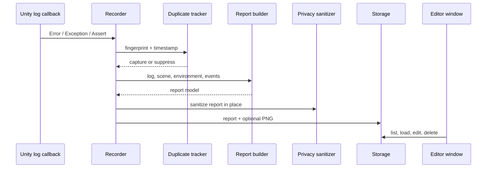

# 設計

BugShot AIは、Unityのログcallbackから、周辺情報の収集、重複抑制、文字列のマスク、レポート保存、Editor Windowでの確認までを一方向に処理します。

## 主な処理の流れ



## 実行時処理（Runtime）の責務

| 型 | 分離する理由 |
|---|---|
| `BugShotAIRecorder` | Unity callbackを受け取り、収集処理全体を調整する |
| `BugShotAIEventLogger` | ゲーム側から操作履歴を記録する小さな公開API |
| `BugShotAISettings` / `BugShotAISettingsFile` | 初期値を検証し、`UnityEditor`へ依存せず設定を読み込む |
| `BugShotAIReportBuilder` | レポートモデルを作成し、シーンと実行環境を読み取る |
| `BugShotAIPrivacySanitizer` | 保存前に順序付きのマスク規則を適用する |
| `BugShotAIFingerprint` / `BugShotAIDuplicateTracker` | `MonoBehaviour`に依存しない決定的な重複判定を行う |
| `BugShotAILogRingBuffer` | レポート作成前に直近のConsole情報量を制限する |
| `BugShotAIScreenshotCaptureService` | PNGが取得できなくてもレポート保存を継続する |
| `BugShotAIReportFormatter` | 1つのレポートからJSON、Markdown、日本語／英語Promptを作る |
| `BugShotAIReportStorage` / `BugShotAIStoragePolicy` | ファイル、履歴、削除、保存上限を管理する |
| `BugShotAIPathUtility` / `BugShotAITextUtility` | パスの正規化と文字数制限を共通化する |
| `BugShotAIModels` | serialize可能なレポートデータと保存結果を定義する |

以前はJSON、Markdown、Promptを別々のクラスで生成していましたが、入力とライフサイクルが同じだったため`BugShotAIReportFormatter`へまとめました。実行環境の収集も、レポート作成時だけ必要なため`BugShotAIReportBuilder`に置いています。

## Editor拡張側の責務

- `BugShotAIWindow`：記録状態、レポート一覧・詳細、メモ、確認、出力、削除
- `BugShotAISettingsProvider`：`Project Settings > BugShot AI`
- `BugShotAIEditorSettingsUtility`：設定項目、安全なパス表示、Editorログの共通処理

Editor WindowはUnity IMGUIと`EditorStyles`を使用し、独自の色、フォント、グラデーション、アニメーションは使用しません。

## 実行用・Editor用のAssembly構成

- `yp.bugshot-ai`：Runtimeの収集・レポート処理。`UnityEditor`参照なし
- `yp.bugshot-ai.editor`：Editor WindowとSettings Provider。Editor専用
- `yp.bugshot-ai.tests.editor`：EditModeテストとコマンドライン検証。Editor専用

Runtime Assemblyは現在Playerビルドにも含まれます。Unity 6000.4.6f1のWindows Playerビルド確認は成功しています。パッケージ全体をEditor専用にする場合は、公開収集APIの移動を伴うため、見た目上のasmdef変更ではなく製品APIの判断として扱います。

## レポート構成

```text
BugShotReports/
  <report-id>/
    report.json
    report.md
    screenshot.png
    prompt_ja.txt
    prompt_en.txt
```

旧形式の`BugShotAI/bugshot_*.json`も読み込めるため、更新後に既存のローカルレポートが見えなくなることはありません。
