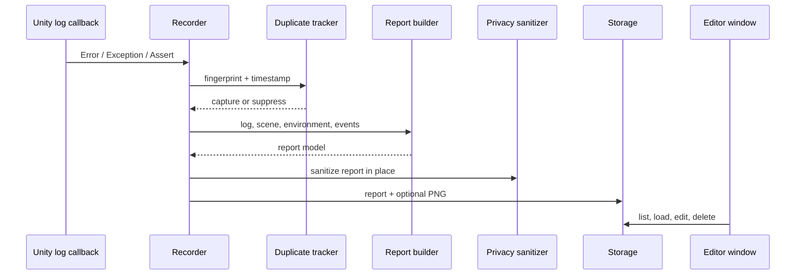

# Architecture

BugShot AI follows one path: Unity log callback -> capture context -> suppress duplicates -> mask text -> write a report -> inspect it in the Editor Window.

## Main Flow



## Runtime Responsibilities

| Type | Reason to keep separate |
|---|---|
| `BugShotAIRecorder` | Owns Unity callbacks and coordinates the capture flow. |
| `BugShotAIEventLogger` | Small public API used by gameplay code to record breadcrumbs. |
| `BugShotAISettings` / `BugShotAISettingsFile` | Validates defaults and loads project settings without `UnityEditor`. |
| `BugShotAIReportBuilder` | Builds the report model and reads scene/environment state. |
| `BugShotAIPrivacySanitizer` | Applies ordered masking rules before storage. Its edge cases need direct tests. |
| `BugShotAIFingerprint` / `BugShotAIDuplicateTracker` | Keeps duplicate rules deterministic and independent of `MonoBehaviour`. |
| `BugShotAILogRingBuffer` | Bounds recent Console data before a report is created. |
| `BugShotAIScreenshotCaptureService` | Contains Unity screenshot failure handling so a missing PNG does not stop the report. |
| `BugShotAIReportFormatter` | Produces JSON, Markdown, and JP/EN prompts from one report. |
| `BugShotAIReportStorage` / `BugShotAIStoragePolicy` | Owns files, history, deletion, and storage limits. |
| `BugShotAIPathUtility` / `BugShotAITextUtility` | Shared path normalization and bounded text handling. |
| `BugShotAIModels` | Serializable report data and small storage result types. |

The formatter used to be split into separate JSON, Markdown, and prompt classes. They had the same input and no independent lifecycle, so they were combined.

Environment collection also moved into `BugShotAIReportBuilder` because it is only needed while a report is built.

## Editor Responsibilities

- `BugShotAIWindow`: recording status, report list, report detail, notes, preview, export, and deletion.
- `BugShotAISettingsProvider`: `Project Settings > BugShot AI`.
- `BugShotAIEditorSettingsUtility`: shared settings fields, safe path labels, and Editor logging.

The Editor Window uses Unity IMGUI and `EditorStyles`. It does not use custom colors, fonts, gradients, or animation.

## Assemblies

- `yp.bugshot-ai`: Runtime capture and report logic; no `UnityEditor` reference.
- `yp.bugshot-ai.editor`: Editor Window and Settings Provider; Editor-only.
- `yp.bugshot-ai.tests.editor`: EditMode and command-line validation; Editor-only.

The Runtime assembly currently enters Player builds. A clean Unity 6000.4.6f1 Windows Player build smoke test passed. Making the entire package Editor-only would require moving public capture APIs and is left as a future product decision.

## Report Layout

```text
BugShotReports/
  <report-id>/
    report.json
    report.md
    screenshot.png
    prompt_ja.txt
    prompt_en.txt
```

Legacy flat `BugShotAI/bugshot_*.json` reports remain readable so existing local reports are not hidden after upgrading.
