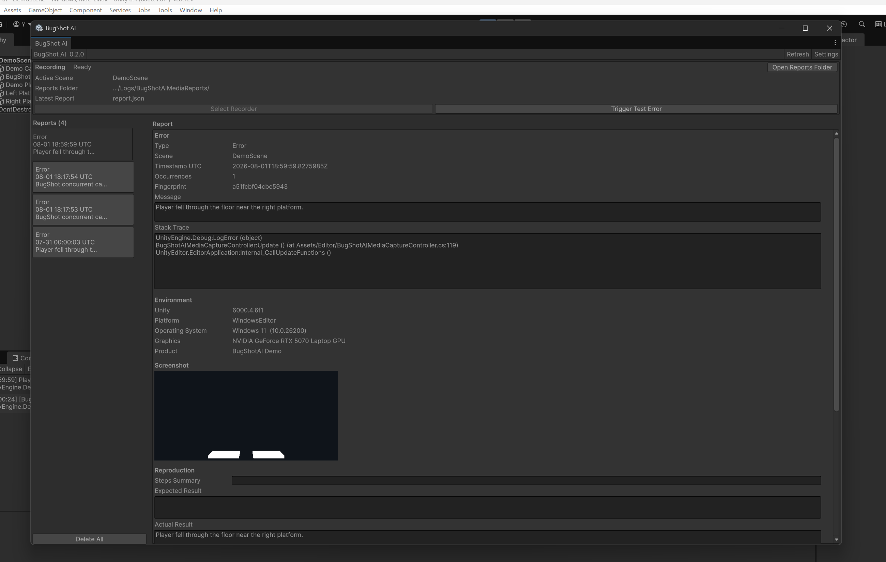
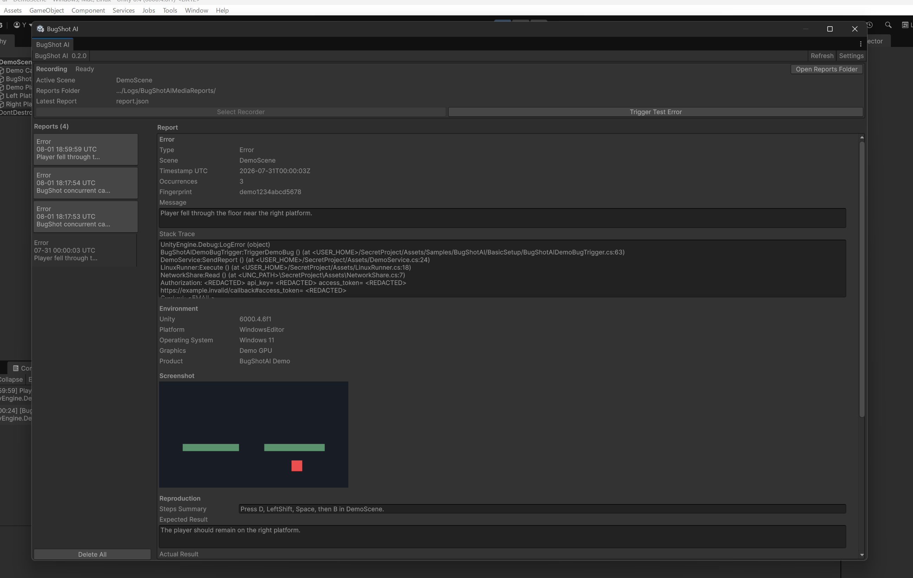
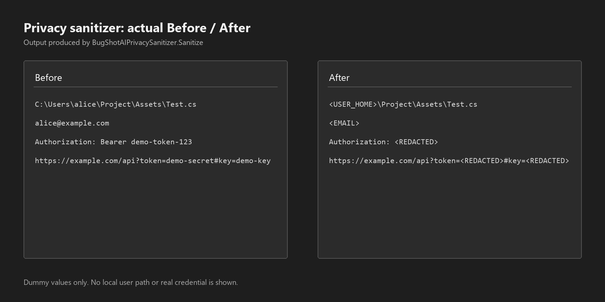

# BugShot AI for Unity

BugShot AI saves the context around a Unity Error or Exception so a developer can review it before writing an Issue or asking an AI tool for help.

It does not find or fix bugs, and it does not send reports outside the local machine.

## What Problem It Solves

When I reproduced a Unity bug, the Console message was often available but the surrounding context was not. I still had to explain which Scene was open, what happened immediately before the error, which Unity environment was running, and whether the Game View showed anything useful.

Copying a raw stack trace also risked sharing a local user path or token-like value. I built this package to capture those details when Unity logs the error, mask common sensitive text, and leave the result for the developer to review.

## Demo

The Basic Setup sample contains two scripts for checking the capture flow in a Scene of your choice:

1. Import the Basic Setup sample.
2. Add `BugShotAIDemoBugTrigger` or `BugShotAIDemoErrorPanel` to a GameObject in your Scene.
3. Open `Tools > BugShot AI > Open Window` and create a Recorder if the Scene does not already contain one.
4. Enter Play Mode.
5. With `BugShotAIDemoBugTrigger`, press `D -> LeftShift -> Space -> B`. With `BugShotAIDemoErrorPanel`, click `Debug.LogError`.
6. Unity logs the demo Error and creates a report.
7. Select the new report and review its Error, Screenshot, recent events, privacy preview, Markdown, and prompt.

[Watch the 56-second repository demo](Documentation~/demo/bugshot-ai-demo.mp4) (1920x1080, no audio).







The sanitized files in [Documentation~/ExampleReport/](Documentation~/ExampleReport/) provide a reproducible text-output example.

## Before / After

The first MVP completed the capture flow, but it exposed concrete problems:

- `BugShotAIRecorder` requested the screenshot, assembled JSON, and saved files itself.
- Prompt text was built in the Editor Window, so it was difficult to test without the UI.
- Repeated identical errors could create many JSON and PNG files.
- Privacy handling only replaced a report path when building a prompt.
- Batchmode screenshot capture returned no texture.

The current version keeps the Recorder as the Unity callback coordinator and moves deterministic or failure-prone work behind concrete classes:

- reports use one folder with fixed filenames
- formatting is independent of the Editor Window
- a fingerprint cooldown limits repeated screenshot and disk work
- reports are sanitized before JSON, Markdown, or prompts are written
- screenshot failure is stored as data and the text report still saves

## Installation and Setup

Install from a Git URL in Unity Package Manager:

```text
https://github.com/ypkabu/bugshot-ai-unity.git?path=Packages/com.yp.bugshot-ai
```

The package manifest minimum is Unity 6000.4.

1. Open `Tools > BugShot AI > Open Window`.
2. Click `Create Recorder In Scene`.
3. Optionally assign `Player Transform` on the Recorder.
4. Configure capture, privacy, and storage under `Project Settings > BugShot AI`.
5. Enter Play Mode and trigger an Error or Exception.
6. Select the report and review it before copying or sharing anything.

## Main Features

- Captures configured Unity `Error`, `Exception`, `Assert`, and `Warning` logs.
- Stores scene information, environment, FPS, optional player position, breadcrumbs, and recent Console logs.
- Writes JSON, Markdown, JP/EN prompt text, and an optional PNG into one report folder.
- Lists reports and displays their Error, Environment, Screenshot, Reproduction, Privacy, and Export information in an Editor Window.
- Limits repeated capture work using a fingerprint cooldown.
- Deletes the oldest report folders when the configured count or approximate size limit is exceeded.
- Keeps Runtime code free of `UnityEditor` references.

Gameplay code can record a short breadcrumb:

```csharp
BugShotAIEventLogger.Record("Player", "Jumped near platform edge");
```

## Actual Output

```text
BugShotReports/
  20260731_071500_123_ab12cd34/
    report.json
    report.md
    screenshot.png
    prompt_ja.txt
    prompt_en.txt
```

`screenshot.png` is omitted when Unity cannot capture a texture. In that case, `report.json` contains `screenshotError` and the remaining files are still written.

The JSON contains the error identity, Scene, user notes, optional player position, environment, recent events, and recent logs. See the checked-in [sanitized example](Documentation~/ExampleReport/).

## Design Decisions

### Recorder as coordinator

`BugShotAIRecorder` owns Unity callbacks, FPS sampling, the optional player Transform, and the capture sequence. Masking, duplicate decisions, formatting, and storage stay outside the component because each has deterministic tests or a separate failure boundary.

### Fingerprint cooldown

The fingerprint uses the log type, condition, and first useful stack line. Timestamp, Scene, FPS, and player position are excluded because those changing values would stop repeated instances of the same error from matching.

Suppressed occurrences are counted in memory, but screenshot capture and disk writes are skipped until the cooldown expires.

### Privacy order

Masking runs in this order: known project and home roots, generic user paths, optional email, authorization and token-like text, then optional IP addresses. Specific roots run first so a project path can keep the more useful `<PROJECT_ROOT>` label.

### Screenshot fallback

An Error can be raised while the Editor is drawing a non-Game UI target, so Play Mode capture waits for the end of the frame before calling `ScreenCapture.CaptureScreenshotAsTexture()`. The API can still return no texture in batchmode or without a usable render target. The PNG is supporting evidence, so its failure does not discard the Error, stack trace, environment, or breadcrumbs.

### Storage limits

The default limit is 50 report folders and approximately 256 MB. Cleanup selects the oldest folders first. The selection rule is tested separately from file deletion.

### Runtime and Editor assemblies

Play Mode capture and the public breadcrumb API remain in the Runtime assembly. The Window and Project Settings UI are in an Editor-only assembly that references Runtime. Runtime does not reference `UnityEditor`.

More detail is available in [ARCHITECTURE.md](Documentation~/ARCHITECTURE.md) and [DESIGN_DECISIONS.md](Documentation~/DESIGN_DECISIONS.md).

## Approaches I Did Not Adopt

I did not add automatic GitHub Issue posting or external AI submission. Those paths require authentication storage, permission and network error handling, and a stronger confirmation step. More importantly, automatic sending could expose project information before the developer reviews the masked text and screenshot.

The package stops at local files and explicit copy actions.

## Privacy

The sanitizer is pattern-based. This test-style example matches the current output:

Before:

```text
C:\Users\alice\Project\Assets\Test.cs
Authorization: Bearer demo-token
```

After:

```text
<USER_HOME>\Project\Assets\Test.cs
Authorization: <REDACTED>
```

It also handles macOS and Linux home paths, UNC user paths, email addresses, GitHub token-like strings, secret assignments, URL secrets, and optional IP addresses. It cannot know every project-specific name, and screenshots always require manual review. See [SECURITY_AND_PRIVACY.md](Documentation~/SECURITY_AND_PRIVACY.md).

## Duplicate Suppression

SubmissionValidation emits the same `Debug.LogError` five times during a 60-second cooldown and verifies that one report folder is created. A separate tracker assertion verifies that suppressed occurrences still increase its in-memory count.

The first saved JSON is not rewritten for each suppressed hit, so its `occurrenceCount` describes the capture that created that file. The current tests do not claim otherwise.

## Validation

EditMode tests cover 30 deterministic cases: masking, text limits, fingerprint stability, duplicate rules, formatting, storage policy, and storage error handling.

SubmissionValidation uses actual Unity callbacks and file-system boundaries. `RunAll` checks 27 capture, storage, privacy, duplicate, Editor registration, sample, and screenshot-fallback cases. Persistence Phase 1 saves settings and report state in one Unity process; Phase 2 starts another Unity process and verifies 3 restart outcomes after 2 Phase 1 checks.

The clean UPM pass creates a separate Unity project, resolves the local package, runs the same tests and validation phases, then performs a Windows Player Build smoke check.

Commands and result files are documented in [TESTING.md](Documentation~/TESTING.md). The short interactive pass is in [QA_CHECKLIST.md](Documentation~/QA_CHECKLIST.md).

Latest verified environment:

- Unity 6000.4.6f1 Windows Editor
- Package compile: Pass
- Original project EditMode: 30 passed / 0 failed
- Original project SubmissionValidation: 27/27; Persistence 2/2 and 3/3
- Clean UPM project EditMode: 30 passed / 0 failed
- Clean UPM SubmissionValidation: 27/27; Persistence 2/2 and 3/3
- Clean Windows Player Build smoke: Pass

## Limitations

- `package.json` requires Unity 6000.4; verification was performed with Unity 6000.4.6f1 on Windows.
- Unity 2022.3 LTS has not been tested.
- Screenshot capture may fail in batchmode, outside Play Mode, or without a usable render target.
- Reports still save when no screenshot is available.
- Masking can produce false positives and cannot guarantee removal of every project-specific value.
- Screenshots may contain visual information that text masking cannot inspect.
- Suppressed duplicate hits do not rewrite the first saved report's occurrence count.
- Reports are not sent automatically to GitHub or an external AI service.
