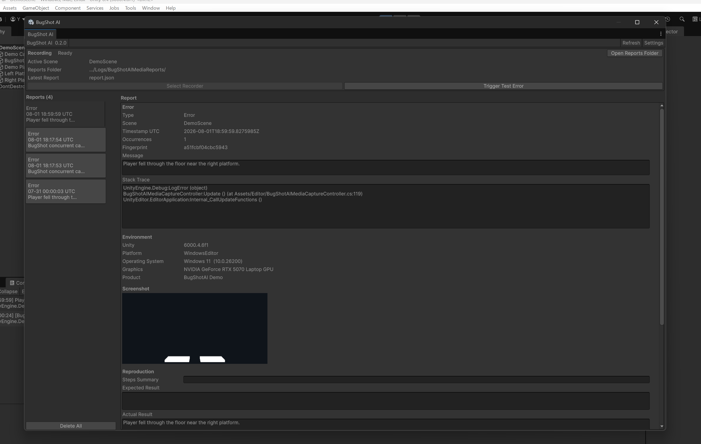

# BugShot AI for Unity

BugShot AIは、Unity Editor上でエラーや例外が発生したときに、ログ、シーン情報、直前のイベント、任意のスクリーンショットをまとめてレポートとして保存する、ローカル動作のEditor拡張です。

バグの検出や修正は行わず、レポートを外部へ送信することもありません。デバッグやGitHub Issueの作成に役立つ情報を、手元に残すことを目的としています。



[🎥 56秒デモ動画](Packages/com.yp.bugshot-ai/Documentation~/demo/bugshot-ai-demo.mp4) · [生成レポート例](Packages/com.yp.bugshot-ai/Documentation~/ExampleReport/) · [ソースコード](Packages/com.yp.bugshot-ai/Runtime/) · [設計](Packages/com.yp.bugshot-ai/Documentation~/ARCHITECTURE.md)

## すぐ試す

Unity `6000.4.6f1` / WindowsでGit URL導入を検証済みです。Unity Package Managerの `Add package from git URL` に次を指定します（Gitが必要です）。

```text
https://github.com/ypkabu/bugshot-ai-unity.git?path=Packages/com.yp.bugshot-ai
```

**導入後、30秒〜1分を目安にレポート生成を試す**（操作の目安で、ダウンロード・Import待ち時間や実測保証は含みません）：

1. 任意のシーンを開き、`Tools > BugShot AI > Open Window` を選択します。
2. `Create Recorder In Scene` を押し、Play Modeに入ります。
3. Windowの `Trigger Test Error` を押し、新しいレポートを選択します。
4. Error、Markdown、Promptを確認します。共有前に、マスク後の文章とスクリーンショットを目視確認してください。

このErrorは動作確認用です。独立したDemo Triggerを使う場合は、Package ManagerのSamplesから `Basic Setup` をImportし、[サンプル手順](Packages/com.yp.bugshot-ai/README.md#デモ)に従ってください。実装のMenuは `Window` ではなく `Tools` 配下です。

## 何をするツールか

Error / Exception → ログ・Scene・環境・記録済みイベントを収集 → Privacyマスク → ローカルReport保存 → Prompt出力

直前操作は `BugShotAIEventLogger.Record(...)` で記録したイベントです。操作をすべて自動追跡するものではありません。AIへの送信や修正は行わず、確認・コピー後の利用は開発者が判断します。

| 項目 | 内容 |
| --- | --- |
| 技術 | Unity / C# / UPM / IMGUI / Assembly Definition |
| 検証環境 | Unity 6000.4.6f1 / Windows Editor、package 0.2.0 |
| 導入条件 | package.jsonはUnity 6000.4以降を要求。2022.3 LTSは未検証 |
| 公開範囲 | Runtime収集API、Editor Window、Sample、テスト |

## 見てほしいコード

- [Recorder](Packages/com.yp.bugshot-ai/Runtime/BugShotAIRecorder.cs)：Unity callbackと収集順序の調整。
- [Privacy Sanitizer](Packages/com.yp.bugshot-ai/Runtime/BugShotAIPrivacySanitizer.cs)：保存前の文字列マスク。
- [Runtime](Packages/com.yp.bugshot-ai/Runtime/) / [Editor](Packages/com.yp.bugshot-ai/Editor/)：実行用とEditor専用Assemblyの分離。
- [設計判断](Packages/com.yp.bugshot-ai/Documentation~/DESIGN_DECISIONS.md)：重複書き込みの抑制、スクリーンショット失敗時の継続など。

## 関連資料

- [パッケージの説明・デモ](Packages/com.yp.bugshot-ai/README.md)
- [設計資料](Packages/com.yp.bugshot-ai/Documentation~/ARCHITECTURE.md)
- [テスト](Packages/com.yp.bugshot-ai/Documentation~/TESTING.md)
- [セキュリティ・プライバシー](Packages/com.yp.bugshot-ai/Documentation~/SECURITY_AND_PRIVACY.md)

インストール可能なUPMパッケージは`Packages/com.yp.bugshot-ai/`にあります。

## 検証状況

- Windows Editor上のUnity `6000.4.6f1`で検証済み
- Unity `2022.3 LTS`は未検証
- RuntimeとEditorのAssemblyを分離
- Runtimeコードから`UnityEditor`への参照なし

2026-09-29に新規プロジェクトで上記Git URLを解決し、コンパイル、EditMode `30/30`、実動作検証 `27/27`、再起動をまたぐ永続化 `2/2・3/3`、Basic Setupの実Importを確認しました。2026-10-03には通常Editorの実画面でもRecorder作成、テストError、SampleのError / Exception、PNG保存とプレビューを確認しました。実際のCopyボタンから得たMarkdown・日英Promptは保存ファイルと全文一致し、JSON Pathも保存先へ解決しました。[再現手順・結果と未検証範囲](Packages/com.yp.bugshot-ai/Documentation~/TESTING.md)

## 制限・ライセンス

文字列マスクは完全な匿名化ではなく、スクリーンショットは目視確認が必要です。batchmodeなどで画像を取得できない場合も、理由付きのテキストReportを保存します。

パッケージは[MIT License](Packages/com.yp.bugshot-ai/LICENSE.md)です。Unity本体とUPM依存パッケージには各提供元の条件が適用されます。
